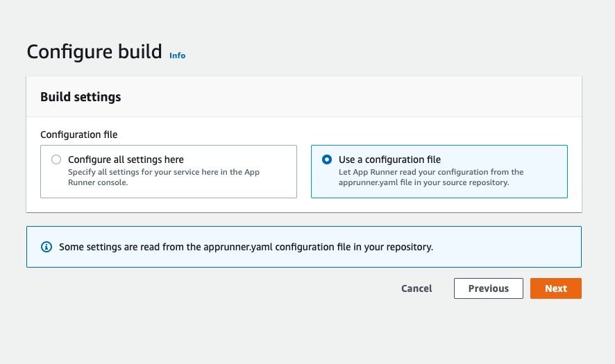

# Kontinuerlig integrasjon og deployment med AWS Apprunner pg GitHub actions

I denne oppgaven får dere en introduksjon til tjenesten AWS Apprunner og skal få trene på kontinuerlig integrasjon og deployment.
Istedet for Travis-ci.com skal vi bruke GitHub actions for å kontrollere kode


## Før du begynner

- Du trenger NPM installer på din maskin
- Windows <https://nodejs.org/en/download/>
- OSX   ```brew install node```

## Leg et nytt repository

Med din egen GitHub bruker, lag et nytt repository. Leg en klone av dette repositoryet, og kopier filene. Du trenger bare filene in "rot" katalogen. 

## Test applikasjonen

I dette repositoryet er det en liten Javascript/Node applikasjon som ikke gjør noe annet enn å returnere et enkelt 
JSON objekt i HTTP Response. 

Gå til katalogen med kildekode og skriv  ````npm start````
Deretter kan du teste applikasjonen på <http://localhost:3000/>
I nettleseren din skal du se en respons 

Hvis du ser i ````payload.js```` og ```payload.test.js``` vil du se at det finnes en veldig enkel unit test basert 
på rammeverket "jest" som sjekker at payload funksjonen fungerer som den skal. Forsøk gjerne å brekke testen og 
kjør deretter

```
npm test
```


## Kontinuerlig integrasjon med GitHub Actions

- I ditt repository lag en katalog som heter .github/workflows.
- Lag en fil med følgende innhold, og kall den npm.yml

```yaml
name: NPM

on: [push]

jobs:
  build:
    runs-on: ubuntu-latest
    strategy:
      matrix:
        node-version: [12.x, 14.x]
    steps:
    - uses: actions/checkout@v2
    - name: Build on Node.js ${{ matrix.node-version }}
      uses: actions/setup-node@v1
      with:
        node-version: ${{ matrix.node-version }}
    - run: npm ci --ignore-scripts
    - run: npm test 
```

Dette er et eksempel på hvordan man konfigurer en veldig enkel sjekk for et Javascriptprosjekt ved hjelp av GitHub Actions.
Denne Workflowen har følgende egenskaper; 

- Kjører på hver push mot Github 
- Sjekker ut koden
- Kjører flere bygg (Matrix) sjekker koden både mot Node JS v12 og 14
- Kjører ````npm ci```` og ```npm test```

Vi skal senere se på bygg & deployment av Java/Spring Boot applikasjoner på samme måte.
 
 
## Konfigurer Branch protection på repoet

- Gå til Settings/Branches og Se etter seksjonen "Branch Protection Rules". 
- Velg Add
- Velg Main Som branch 

- Legg til "Require status checks to pass before merging", og velg alle node JS byggene.

Det betyr at alle nodeJS versjonene må bygge applikasjonen for at vi skal få lov til å merge
koden mot main


 

Du bør nå sjekke inn litt kode som brekker tester med vilje, for å sjekke at Branch protection fungerer som planlagt. 

## Gå til tjenestep App Runner 

Vi skal nå sette opp kontinuerlig deployment av dette repoet ved hjelp av PAAS tjenesten AWS Apprunner.

- Logg på AWS miljøet ved hjelp av instruksjoner gitt i klasserommet eller på Canvas
- Gå til tjenesten "AWS App runner". Pass på at du har "irland" valgt som region. 
- Velg "Create Service"


- Velg Source code repository, og klikk "Add New" under "Connect to GitHub"


## Connect med github 

En "GitHub Connection" gir AWS tilgang til å lese kildekode fra din GitHub bruker. En AWS app installeres også 
i din GitHub konto. 

- Velg "Install Another"


- Ta stilling til om du vil gi AWS Appen tilgang til alt du har i ditt repo, eller om du vil gi tilgang på en "Per repo basis"


- Nå er alt klart, velg Next 


## Konfigurasjon av app

- Velg GitHub Connection du nettopp laget, og repoet du har laget for denne øvelsen, main branch, og "automatic deployment"


- Velg Next

- Velg "configure all settings here" og bruk verdier som vist 



- Velg next

## Review

Se over verdier og scroll nederst til "Create service"
 

## Sjekke at tjenesten er deployet. 

Se i AWS Consolet til tjenesten, finn URL og sjekk i nettlser

## Utvid applikasjonen 

Lek med applikasjonen og gjør minst følgende; 

- Endre payload, se at en ny versjon bli automatisk deployet 
- Legg til Bran Protection på repositoriet som vi gjorde i forrige øving. Bygget som GitHub Actions lager heter "build" - det er det du må søke etter 
i "Status Checks" dialogen under Branch protection. 
- Lag en ny branch i eget repo, endre en test for å provosere frem en feil, lag en PR og se at du ikke får sjekket den inn.
